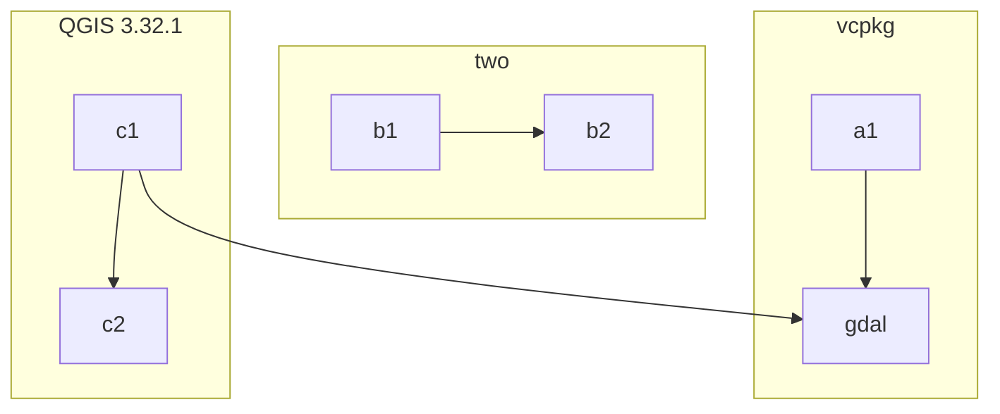
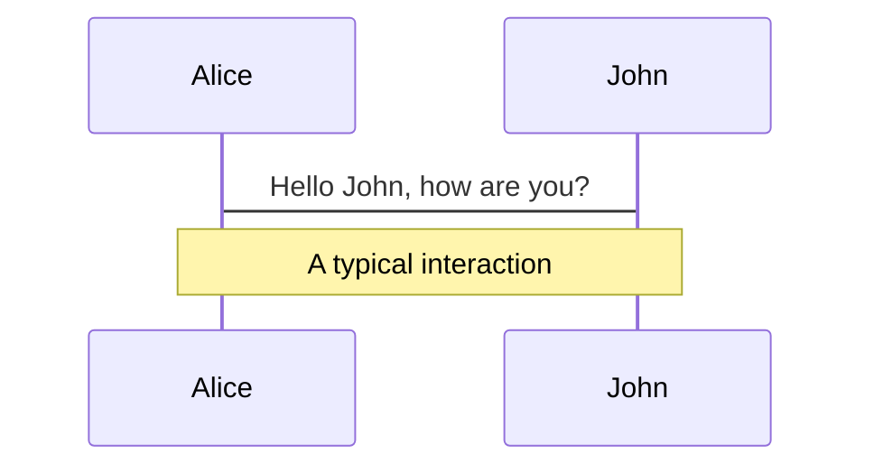
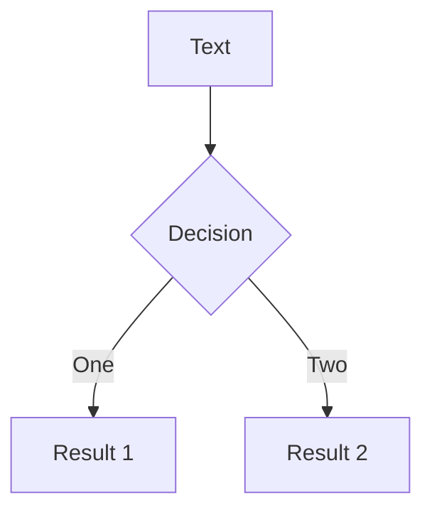

<div class="pt-12 rounded-xl bg-white bg-opacity-85">
<h1>QGIS im Browser dank WebAssembly</h1>
  <span @click="$slidev.nav.next">
    <h2 style="padding-bottom: 0.5em"><a>Andreas Neumann</a> &amp; <a>Michael Schmuki</a></h2>
    <h3>FOSSGIS-Konferenz 2024 @ Hamburg</h3>
  </span>
  <br /><br />
</div>

<div class="abs-br m-6 flex gap-2">
  <button @click="$slidev.nav.openInEditor()" title="Open in Editor" class="text-xl slidev-icon-btn opacity-50 !border-none !hover:text-white">
    <carbon:edit />
  </button>
  <a href="https://github.com/slidevjs/slidev" target="_blank" alt="GitHub" title="Open in GitHub"
    class="text-xl slidev-icon-btn opacity-50 !border-none !hover:text-white">
    <carbon-logo-github />
  </a>
</div>

<!--
The last comment block of each slide will be treated as slide notes. It will be visible and editable in Presenter Mode along with the slide. [Read more in the docs](https://sli.dev/guide/syntax.html#notes)
-->

---
layout: image-right
image:
hideInToc: true
---

# Inhalt

<Toc maxDepth="1"></Toc>

---
title: Intro
layout: image-left
image:
---

### Alles begann in ’s-Hertogenbosch

<br />

<div v-click>
  <p>
    QGIS User Conference, April 2023
  </p>
<p>

- Martin Dobias
- Michael Schmuki
- Andreas Neumann

</p>
  

  <br />

</div>

<div v-click>
  <p>
  Machbarkeitsstudie für den <b>Atlas der Schweiz</b>
  </p>
<p>

- Institut für Kartografie und Geoinformation
  - ETH Zürich
- Sommer & Herbst 2023

</p>
  
</div>

---
title: Was ist qgis-js?
---

# Was ist qgis-js?

QGIS core ported to WebAssembly to run it on the web platform

qgis-js repository on [GitHub?](https://github.com/qgis/qgis-js)

---
title: WebAssembly
---

# Webassembly Intro

---
title: Architektur
routeAlias: architektur
---

# Architektur

## draw.io?


---
hideInToc: true
---

# What is Slidev?

Slidev is a slides maker and presenter designed for developers, consist of the following features

- 📝 **Text-based** - focus on the content with Markdown, and then style them later
- 🎨 **Themable** - theme can be shared and used with npm packages
- 🧑‍💻 **Developer Friendly** - code highlighting, live coding with autocompletion
- 🤹 **Interactive** - embedding Vue components to enhance your expressions
- 🎥 **Recording** - built-in recording and camera view
- 📤 **Portable** - export into PDF, PNGs, or even a hostable SPA
- 🛠 **Hackable** - anything possible on a webpage

<br>
<br>

Read more about [Why Slidev?](https://sli.dev/guide/why)

<style>
h1 {
  color: #4EC5D4
}
</style>

---
hideInToc: true
---

# Table of contents

<Toc maxDepth="1"></Toc>

---
routeAlias: architecture
---

# Architecture

## draw.io?


## Mermaid?

<div
  style="margin: 1em"
>

</div>

---
layout: center
class: text-center
routeAlias: slidev-demo
---

# slidev starter slides form here:

---
transition: slide-up
level: 2
routeAlias: slidev-navigation
hideInToc: true
---

# Navigation

Hover on the bottom-left corner to see the navigation's controls panel, [learn more](https://sli.dev/guide/navigation.html)

### Keyboard Shortcuts

|                                                    |                             |
| -------------------------------------------------- | --------------------------- |
| <kbd>right</kbd> / <kbd>space</kbd>                | next animation or slide     |
| <kbd>left</kbd> / <kbd>shift</kbd><kbd>space</kbd> | previous animation or slide |
| <kbd>up</kbd>                                      | previous slide              |
| <kbd>down</kbd>                                    | next slide                  |

<!-- https://sli.dev/guide/animations.html#click-animations -->


<p v-after class="absolute bottom-23 left-45 opacity-30 transform -rotate-10">Here!</p>

---
layout: image-right
image: https://source.unsplash.com/collection/94734566/1920x1080
routeAlias: slidev-code
hideInToc: true
---

# Code

Use code snippets and get the highlighting directly![^1]

```ts {all|2|1-6|9|all}
interface User {
  id: number;
  firstName: string;
  lastName: string;
  role: string;
}

function updateUser(id: number, update: User) {
  const user = getUser(id);
  const newUser = { ...user, ...update };
  saveUser(id, newUser);
}
```

<arrow v-click="3" x1="400" y1="420" x2="230" y2="330" color="#564" width="3" arrowSize="1" />

[^1]: [Learn More](https://sli.dev/guide/syntax.html#line-highlighting)

<style>
.footnotes-sep {
  @apply mt-20 opacity-10;
}
.footnotes {
  @apply text-sm opacity-75;
}
.footnote-backref {
  display: none;
}
</style>

---
routeAlias: slidev-components
hideInToc: true
---

# Components

You can use Vue components directly inside your slides.

We have provided a few built-in components like `<Tweet/>` and `<Youtube/>` that you can use directly. And adding your custom components is also super easy.

```html
<Counter :count="10" />
```

<!-- ./components/Counter.vue -->
<Counter :count="10" m="t-4" />

Check out [the guides](https://sli.dev/builtin/components.html) for more.

---
preload: false
routeAlias: slidev-animations
hideInToc: true
---

# Animations

Animations are powered by [@vueuse/motion](https://motion.vueuse.org/).

```html
<div v-motion :initial="{ x: -80 }" :enter="{ x: 0 }">Slidev</div>
```

<div class="w-60 relative mt-6">
  <div class="relative w-40 h-40">
    
    
    
  </div>

  <div
    class="text-5xl absolute top-14 left-40 text-[#2B90B6] -z-1"
    v-motion
    :initial="{ x: -80, opacity: 0}"
    :enter="{ x: 0, opacity: 1, transition: { delay: 2000, duration: 1000 } }">
    Slidev
  </div>
</div>

<!-- vue script setup scripts can be directly used in markdown, and will only affects current page -->
<script setup lang="ts">
const final = {
  x: 0,
  y: 0,
  rotate: 0,
  scale: 1,
  transition: {
    type: 'spring',
    damping: 10,
    stiffness: 20,
    mass: 2
  }
}
</script>

<div
  v-motion
  :initial="{ x:35, y: 40, opacity: 0}"
  :enter="{ y: 0, opacity: 1, transition: { delay: 3500 } }">

[Learn More](https://sli.dev/guide/animations.html#motion)

</div>

---
routeAlias: slidev-latex
hideInToc: true
---

# LaTeX

LaTeX is supported out-of-box powered by [KaTeX](https://katex.org/).

<br>

Inline $\sqrt{3x-1}+(1+x)^2$

Block

$$
\begin{array}{c}

\nabla \times \vec{\mathbf{B}} -\, \frac1c\, \frac{\partial\vec{\mathbf{E}}}{\partial t} &
= \frac{4\pi}{c}\vec{\mathbf{j}}    \nabla \cdot \vec{\mathbf{E}} & = 4 \pi \rho \\

\nabla \times \vec{\mathbf{E}}\, +\, \frac1c\, \frac{\partial\vec{\mathbf{B}}}{\partial t} & = \vec{\mathbf{0}} \\

\nabla \cdot \vec{\mathbf{B}} & = 0

\end{array}
$$

<br>

[Learn more](https://sli.dev/guide/syntax#latex)

---
routeAlias: slidev-diagrams
hideInToc: true
---

# Diagrams

You can create diagrams / graphs from textual descriptions, directly in your Markdown.

<div class="grid grid-cols-3 gap-10 pt-4 -mb-6">





</div>

[Learn More](https://sli.dev/guide/syntax.html#diagrams)

---
routeAlias: slidev-learn-more
layout: center
class: text-center
hideInToc: true
---

# Learn More

[Documentations](https://sli.dev) · [GitHub](https://github.com/slidevjs/slidev) · [Showcases](https://sli.dev/showcases.html)
